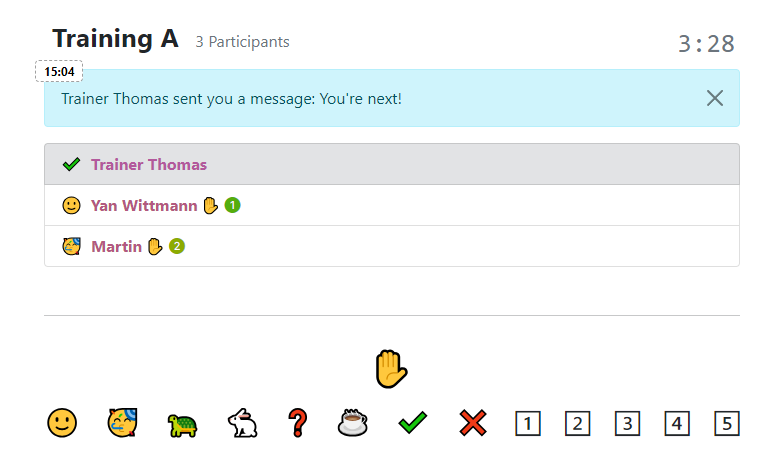
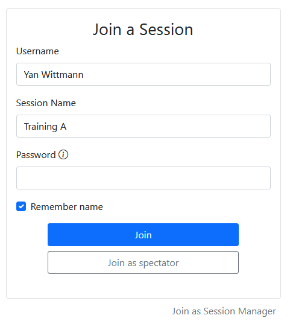
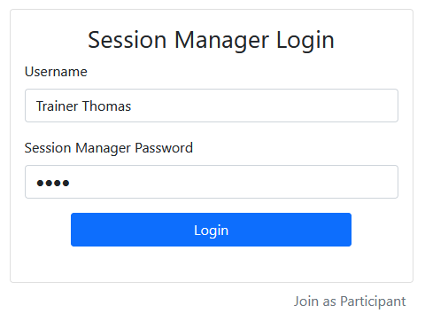
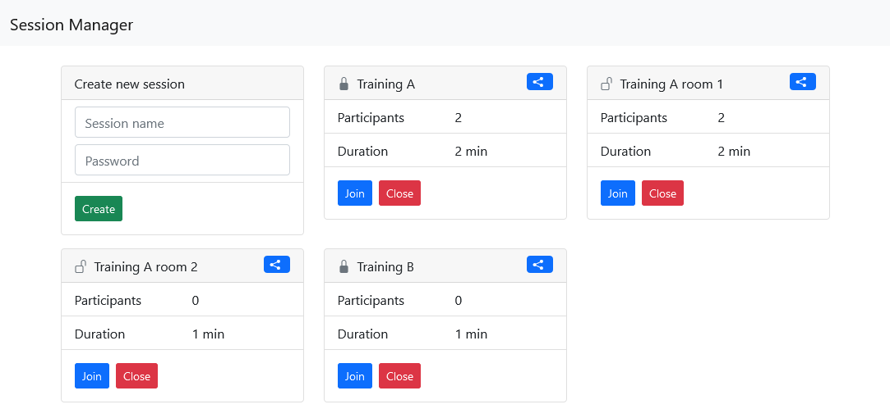
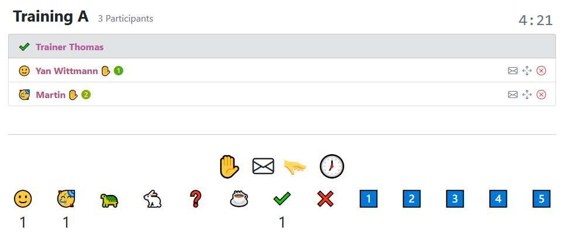

# [Presentation Live Feedback](https://github.com/YanWittmann/presentation-live-feedback)

_Presentation Live Feedback_ allows for the creation of multiple (password-protected) sessions that users can join.
The participants are displayed in a table structure and can each choose between different reactions and raise their
hands.



<!-- TOC -->

* [Presentation Live Feedback](#presentation-live-feedback)
    * [Features](#features)
    * [Running](#running)
    * [How to use](#how-to-use)
    * [Build it yourself](#build-it-yourself)

<!-- TOC -->

## Features

- Multiple parallel sessions
- Password-protected sessions
- Overview dashboard of all active sessions
- No user registration required aside from username
- Reactions and hand raising
- Spectator mode for unlimited participants
- Admins can send messages to all users, reset reactions and hand raising
- Admins can remove users from the session or move them to another session
- Admins can change the session password or close the session

## Running

You will need at least Java 11 to run the application. Download the
[latest version jar here](https://github.com/YanWittmann/presentation-live-feedback/releases).

Command line arguments:

```
java -jar presentation-live-feedback.jar
 -h,   --help               Print this message
 -pwd, --password <arg>     Password for session manager authentication, random otherwise
```

For example:

```
java -jar presentation-live-feedback.jar -pwd 1234
```

## How to use

After starting the application, navigate to http://localhost:8080, where you will be greeted by a login screen.



Click on the `Join as Session Manager` label at the bottom and enter a username and the password you provided when
starting the application.
If you don't know your password, enter `password` in the terminal where you started the application to print it.



If you click `Login`, you will be redirected to the session manager. Yours will be empty at first, but you can create
a new session by entering a unique session name and optionally a password and clicking `Create`.

You can then either share the link via the icon at the top, join a session yourself or close it by clicking the
respective buttons. Copying a link will also copy the password into a URL parameter, so you can share the link
directly with the password.

If you don't want that, remove the password from the URL first or simply share the session name with your participants.



If you join as a session manager, you will have extended options for each session. By hovering over the icons, you
will see a tooltip explaining what each button does.



**If you have questions, feel free to open an issue. If you end up using this application, I would love to hear about
it!**

## Build it yourself

Build the application using [maven](https://maven.apache.org/download.cgi):

```bash
mvn clean package
```

and run it using at least Java 11.

To change the port the application runs on, use the `server.port` property in the
[application.properties](src/main/resources/application.properties) file. The default port is `8080`.
