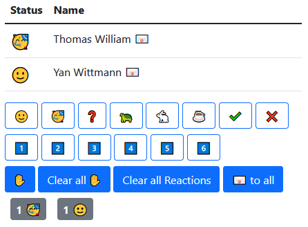

# Presentation Live Feedback

A small java application hosting a web server.  
Allows list of users to show reactions and raise their hands. Using an admin password provided by the application, the
host can send messages to the users and reset their reactions/hand status.



Admin view of the application.

## Setup

Build the application using maven:

```bash
mvn clean package
```

and run it using at least Java 11.

You can pass the flags `-ws=` and `-hs=` for setting the port for the web socket server and the http server respectively.  
The default ports are `-ws=8080` and `-hs=8000`.

`-pw=` can be used to set the admin password to a specific value, otherwise the default is randomly generated.

In the running command line process, type in `password` to print the admin password.  
Use `exit` to exit the application.

Access the web interface at http://localhost:8000/presentation
